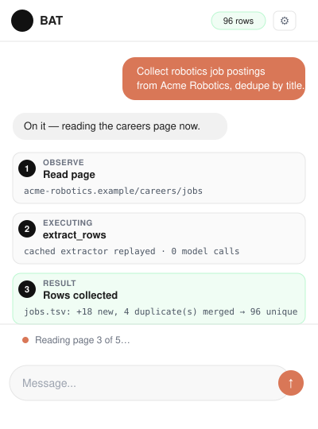
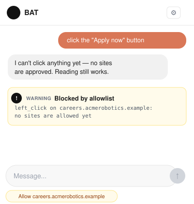
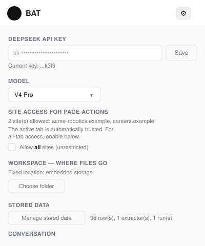
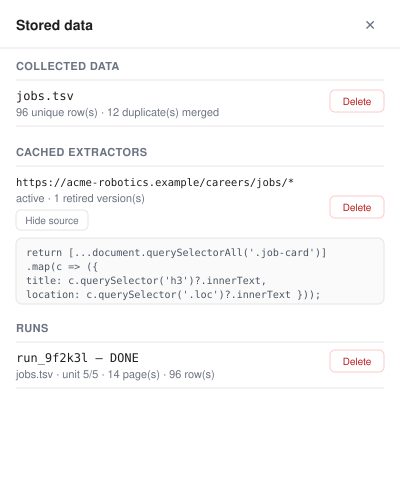
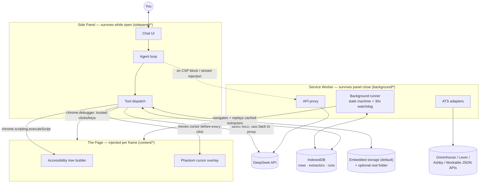
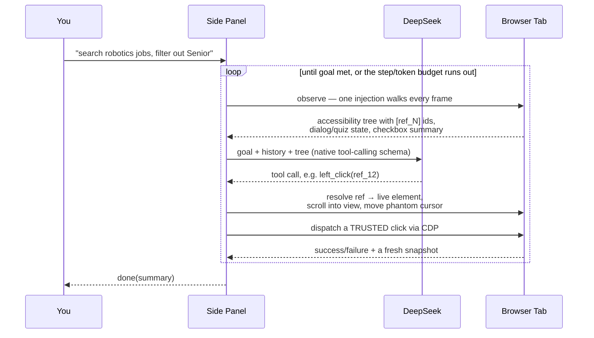
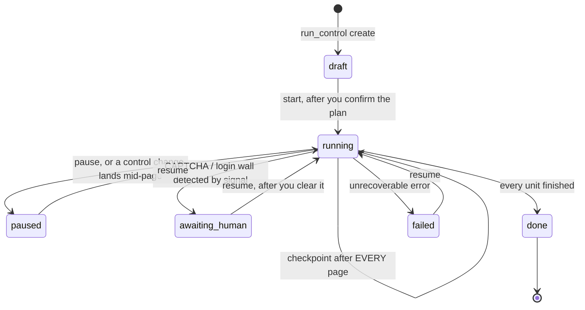
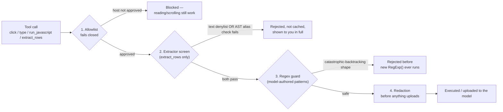

# BAT — Browser Automation Tool

**An AI agent that lives in your browser's side panel and actually drives the page —
not screenshots and guessed coordinates, but a real accessibility tree and trusted input
events.**

[](https://github.com/SATHv1kk/BAT/actions/workflows/build.yml)
[](LICENSE)
[](https://developer.chrome.com/docs/extensions/mv3/intro/)
[](https://nodejs.org/)
[](test/run-tests.mjs)

Give it a goal in plain language and it reads the current page, decides what to do, and
drives the page for you — clicking, typing, scrolling, navigating, and, for larger jobs,
extracting structured data across hundreds of pages without a model call per page.

Instead of guessing at pixel coordinates from a screenshot, BAT builds an **accessibility
tree** of the page and gives every interactive element a stable reference id. The model
picks an element by reference, and clicks are dispatched as **trusted input events**
through the Chrome DevTools Protocol — so pages react exactly as they would to a real user,
not to a synthetic DOM event a page's own script could tell apart.

---

## Interface

The [architecture](#how-it-works) is diagrammed further down; this is the panel itself.
These are mockups built directly against `sidepanel/index.html`'s real CSS (colors,
radii, type scale) and against the exact strings `sidepanel/app.js` renders for each
element — not screenshots of a running install, since a fresh clone starts with no API
key and no collected data to show.

<table>
<tr>
<td width="50%">

**Agent loop, mid-task**


Every step reaches the activity feed as a compact, collapsible entry — not a wall of
"Tool: X" / "Action succeeded" chat blocks.

</td>
<td width="50%">

**Allowlist blocking an action**


Fails closed by default: page-changing tools refuse until you click **Allow**. Reading
and scrolling never needed approval.

</td>
</tr>
<tr>
<td width="50%">

**Settings**


One panel behind the gear icon: API key, model, allowlist status, workspace folder
(embedded storage by default), and stored-data management.

</td>
<td width="50%">

**Stored-data manager**


Every collection, cached extractor (source included), and background run — inspectable
and deletable, nothing invisible or permanent.

</td>
</tr>
</table>

---

## Contents

- [Interface](#interface)
- [How it works](#how-it-works)
- [Tech stack](#tech-stack)
- [Features](#features)
- [Quick start](#quick-start)
- [Configuration](#configuration)
- [Development](#development)
- [Repository layout](#repository-layout)
- [Tools available to the agent](#tools-available-to-the-agent)
- [Security model](#security-model)
- [Permissions](#permissions)
- [Known limits of bulk collection](#known-limits-of-bulk-collection)
- [Manual verification](#manual-verification)
- [Acknowledgments](#acknowledgments)
- [License](#license)

---

## How it works

BAT runs in **three separate execution contexts** that Chrome keeps isolated from each
other by design, wired together over `chrome.runtime` messaging and the DevTools Protocol:



The **side panel** is where you talk to it and where the interactive agent loop runs — but
it dies the moment you close the panel. The **service worker** is where anything that must
survive that lives: the background runner (a resumable state machine for
multi-page/multi-site collection jobs) and the API proxy the panel falls back to when its
own CSP blocks a direct fetch. **Content scripts** are the only code that ever touches the
live page — one per frame, injected at `document_start`, building the accessibility tree
the model reasons over.

### A single turn, step by step



Element references are held as `WeakRef`s in a page-side map, so they never leak memory
and go stale *safely* when the DOM changes — a stale ref returns an error telling the model
to re-read the page, rather than silently clicking whatever now occupies that slot. The
ref registry is discarded on every navigation, so a ref minted against the old document can
never resolve against the new one.

### Background collection runs

For jobs too large to drive page-by-page from the panel (many keywords × many sites ×
many pages), the model compiles a **plan** and hands it to a state machine that runs
entirely inside the service worker — zero model calls per page once an extractor exists
for a site, a checkpoint after *every single page*, and automatic recovery from panel
close, worker eviction, and even a browser restart:



CAPTCHAs and login walls are **detected, never solved** — the run parks in
`AWAITING_HUMAN` and resumes at the exact page once you clear it. A 30-second
`chrome.alarms` watchdog revives the loop if the service worker gets evicted mid-run, and
`onStartup` recovers any run still marked `running` after a full browser restart.

---

## Tech stack

| Layer | What | Why |
| --- | --- | --- |
| Extension platform | **Chrome Manifest V3** — service worker, side panel API, `chrome.debugger`/`chrome.scripting`/`chrome.tabs`/`chrome.alarms` | The current extension model; the side panel API is what puts a persistent chat UI next to any tab. |
| Build | **[Vite](https://vitejs.dev/)** + **[@crxjs/vite-plugin](https://crxjs.dev/vite-plugin)** | Compiles `src/manifest.json` into a valid MV3 bundle, rewrites asset paths, and gives content scripts real HMR during `npm run dev`. |
| Trusted input | **Chrome DevTools Protocol** (`Input.dispatchMouseEvent`/`dispatchKeyEvent`, `Runtime.evaluate`, `Page.captureScreenshot`) via `chrome.debugger` | Pages can tell a synthetic `MouseEvent` from a real one; CDP input cannot be told apart because it isn't synthetic. |
| Page reading | Hand-rolled **accessibility tree** builder (content script) | A compact `role "name" [ref_N]` line per element beats raw HTML for token budget and for giving the model something stable to click. |
| Model | **[DeepSeek](https://platform.deepseek.com/) chat completions API** — native function calling, streaming, reasoning-effort control | The reasoning/cost tier this project targets; the transport layer (`sidepanel/deepseek.js`) is provider-shaped but not provider-agnostic today (see [Configuration](#configuration)). |
| Extractor safety | **[acorn](https://github.com/acornjs/acorn) + [acorn-walk](https://github.com/acornjs/acorn)** | Parses model-authored `extract_rows` source into a real AST so alias tracking (`var w = window; w.fetch(...)`) can be checked structurally, not by text pattern. |
| Regex safety | **[safe-regex](https://github.com/substack/safe-regex)** (backed by **regexp-tree**) | Gates every model-authored regex (plan rules, filters) against catastrophic backtracking before it ever reaches `new RegExp`. |
| Persistence | **IndexedDB** (rows/dedup, cached extractors, runs, event log, and — by default — file storage itself) · **File System Access API** (optional real workspace folder) · `chrome.storage.local` (settings) · `chrome.storage.session` (chat transcript) | The store is the authority for collected data; output files are a projection of it, never the other way round. File storage needs no OS permission at all by default — a real folder is an opt-in upgrade, not a requirement. |
| Quality gates | **ESLint** (flat config) · a from-scratch Node test runner (`test/run-tests.mjs`, no framework dependency) · **fake-indexeddb** (dev-only, for real IndexedDB integration tests in Node) · GitHub Actions CI | 502 offline, deterministic assertions gate every push; a separate scheduled job hits four live ATS endpoints so third-party drift can't redden an unrelated PR. |

---

## Features

**Reading & acting**

- **Side panel UI** — chat alongside any page, no separate window. What the agent is doing
  right now (which tool, which action) shows as one small, continuously-updated status
  line rather than a permanent chat block per step — a long run stays readable instead of
  filling the transcript with dozens of "Tool: X" / "Action succeeded" entries. Nothing is
  lost: every step still reaches the full debug log ("Copy debug log"), and milestones that
  actually matter (rows collected, an extractor's source before it runs, a run plan) stay
  as permanent, visible entries.
- **Accessibility-tree page reading** — compact, structured page state instead of raw
  HTML. Walks into *open* shadow roots too, so Web Components (common in modern design
  systems) aren't invisible — a *closed* shadow root has no JS-reachable API at all, by
  design, so that one genuinely can't be read from script.
- **Trusted input via CDP** — real click and keyboard events, not synthetic DOM events.
- **Phantom cursor** — a visible pointer shows what the agent is about to touch.
- **Coordinate fallback** — for canvas-rendered pages with no useful DOM, the agent reads
  state and element geometry with `run_javascript` and acts with `click_coords`.
  (Screenshots are a separate, currently **disabled** path — see
  [Vision](#vision-is-off-by-default).)
- **Multi-tab** — can open a background tab and work there while you keep your view.
- **Console and network access** — can read logs and requests to diagnose a stuck page.
- **Session persistence** — the conversation transcript survives closing and reopening the
  panel. An in-flight *interactive* turn does not: closing the panel ends it. Background
  runs are the thing built to survive that (see above).

**Data collection at scale**

- **Bulk extraction engine** — `extract_rows` lets the model write a page-specific
  extractor function *once*, caches it in IndexedDB per URL pattern (with version
  history), then replays it across every later page of that site with **zero model
  reading**. Every replay is validated (schema fingerprint, empty required fields,
  row-count collapse, empty-page detection, and an explicit report when the 2,000-row cap
  truncates a page); a failing extractor is retired and re-synthesized once, and a second
  consecutive failure halts the site rather than collecting plausible-looking garbage.
  Every extractor is **safety-screened** before it runs — twice, by two independent
  methods (see [Security model](#security-model)).
- **Direct ATS adapters** — `ats_fetch` pulls a company's whole job board from the public
  Greenhouse / Lever / Ashby / Workable JSON APIs in one HTTP call from the service
  worker: no tab, no tree, no extractor. Includes slug discovery with identity
  verification, a `location_filter` regex, and the same canonical row shape as scraped
  pages — so ATS rows dedup against browser-collected rows automatically.
- **Deduplicating collection store** — `collect_rows` keeps every collected row in
  IndexedDB keyed on a normalized composite of fields you nominate (case, punctuation and
  whitespace insensitive — but *not* so aggressive that `C++ Developer` and `C Developer`
  collide). Duplicates keep the first row and merge the newcomer's source into it; only
  novel rows reach the file. `export_rows` regenerates the file from the store with fully
  merged sources, and `data_report` produces final totals — the file is a projection, the
  store is the authority.
- **Structured data files** — `append_rows` writes TSV/CSV files append-only: header
  exactly once, cells sanitized (tabs/newlines stripped, delimiters escaped, CSV headers
  parsed with the same quoting rules used to write them), rows flushed per unit of work,
  and the running row count always read back from the file itself.
- **Site configs as data, verification as state** — `src/shared/site-configs.js` holds
  per-site search URL templates and pagination rules; a human edits that file. Whether a
  template *actually works* is empirical and per-installation, so
  `run_control {action:"verify"}` loads page 1 in the browser, judges what came back, and
  `mark_verified` records the result in `chrome.storage.local` — which means verification
  survives `git pull` instead of being wiped by it.
- **Resumable background runner** — see [above](#background-collection-runs). Pacing is
  jittered and per-host rate-limited; page budgets are phase-aware so extractor synthesis
  (a model call) isn't judged against a navigation-sized timer.

**Persistence & operations**

- **File storage that just works, plus an optional real folder.** `save_file` / `read_file`
  / `list_files` / `append_rows` need no setup at all — by default they write into
  **embedded storage** (`src/lib/embedded-storage.js`), an IndexedDB-backed store fully
  inside the extension. If you'd rather have real files on disk, grant a folder in
  Settings → Workspace folder (the repo's own [`workspace/`](workspace/) is a ready-made,
  already-`.gitignore`d option); BAT then prefers that folder while its permission is
  valid, and falls back to embedded storage automatically the moment it isn't — Chrome's
  File System Access permission grant is not reliably persistent across browser restarts
  and extension reloads, and a data-collection job must never stall on an OS permission
  dialog mid-run. Every writer, either backend, shares one per-file lock.
- **Stored-data manager** — Settings → *Manage stored data* lists every collection, cached
  extractor (with its source), and run, and lets you inspect or delete any of them, plus
  pause/resume runs without going through the agent.

**Security**

- **Per-site allowlist, closed by default** — page-changing tools run only on origins you
  approve. See [Security model](#security-model).
- **Extractor sandbox, two independent layers** — a text denylist plus a real AST-based
  alias tracker.
- **Regex denial-of-service guard** — model-authored patterns are checked for
  catastrophic backtracking before they ever reach `new RegExp`.
- **Sensitive-value redaction** — password, one-time-code, and payment fields are never
  read back into the model's context, and are stripped from page markup before any of it
  is uploaded for extractor synthesis.

---

## Quick start

Six steps from a clone to BAT clicking something for you.

**1. Build it.** Requires [Node.js](https://nodejs.org/) 18 or newer.

```bash
git clone https://github.com/SATHv1kk/BAT.git
cd BAT
npm install
npm run build
```

**2. Load it into Chrome.**

1. Go to `chrome://extensions`.
2. Enable **Developer mode** (top right).
3. Click **Load unpacked** and select the generated `dist/` folder.
   (`dist/` is a build artifact and is not committed — run `npm run build` again after
   every `git pull`.)
4. Open the panel with the toolbar icon or <kbd>Ctrl</kbd>+<kbd>Shift</kbd>+<kbd>E</kbd>
   (<kbd>Cmd</kbd>+<kbd>Shift</kbd>+<kbd>E</kbd> on macOS).

**3. Set your API key.** BAT talks to the [DeepSeek API](https://platform.deepseek.com/api_keys).
The panel opens Settings automatically on first run — paste your key there. It is stored
in `chrome.storage.local` on your machine and is never sent anywhere except the DeepSeek
API.

**4. Approve a site.** The allowlist is empty on a fresh install and **fails closed**: BAT
can read any page, but it cannot click, type, or run page code anywhere until you say so.
Open the site you want it to act on and click the **Allow \<site\>** button that appears
above the composer — that's the one control for approving sites day-to-day; Settings only
shows how many are currently allowed.

(There's an *Allow all sites* toggle in Settings for the unrestricted old behaviour — it's
off by default on purpose; see [Security model](#security-model) for why.)

**5. Try it.** With a site approved, type a goal in plain language and press Enter, e.g.
*"summarize this page"* (works with zero setup — reading never needed approval) or, on an
approved site, *"click the search box and type 'robotics jobs'"*. Watch the activity
feed: each step shows what BAT read, decided, and did.

**6. If nothing happens:** check the model dropdown has a key configured (send button
stays disabled without one), and check the allowlist status line under Settings — "No
sites are allowed" means page actions are intentionally off until you approve one.

---

## Configuration

### Models

Pick a model from the panel's model selector:

| Model | Notes |
| --- | --- |
| `deepseek-v4-pro` | Default. Strongest reasoning, best for multi-step goals. |
| `deepseek-v4-flash` | Faster and cheaper, good for short tasks. |
| `deepseek-chat` | V3, the previous generation. |

> **Verify these ids against your provider.** They live in `MODEL_OPTIONS` in
> `src/shared/constants.js`. If your account does not serve a given id, BAT reports
> *"Model … was rejected by the API"* with instructions rather than a bare `HTTP 400`.
> Reasoning parameters (`reasoning_effort`, `thinking`) are also optional: if the provider
> rejects them, BAT drops them and retries automatically for the rest of the session.

### Vision is off by default

`VISION_SUPPORTED` in `src/shared/constants.js` is `false`, because **the DeepSeek chat
API does not accept image input.** While it is false:

- the `screenshot` tool is **not offered** to the model at all, and
- no screenshots are captured or held in the conversation.

`click_coords` still works, so canvas-rendered pages are handled by reading geometry with
`run_javascript` and clicking coordinates. Flipping the constant to `true` re-enables the
whole screenshot path — but only for a model that can actually read images; DeepSeek isn't
one, so this needs a different (or additional) backend, not just a flag flip.

---

## Development

```bash
npm run dev        # Vite dev server with hot reload
npm run build      # production build to dist/
npm run preview    # preview the built output

npm run lint       # ESLint (flat config, eslint.config.js)
npm test           # 502 offline assertions — deterministic, no network. Gates CI.
npm run test:live  # only the live ATS checks (fetches four real job boards)
npm run test:all   # both
npm run check      # lint + test + build, i.e. what CI runs
```

`npm test` is fully offline and is the gate for every push and PR. The live ATS section is
separate and runs on a daily schedule, because a third-party endpoint changing is
information — not a reason to turn an unrelated contributor's PR red.

See [CONTRIBUTING.md](CONTRIBUTING.md) for the invariants that matter when changing this
codebase, and [SECURITY.md](SECURITY.md) for the full threat model.

---

## Repository layout

```
src/
├── manifest.json          MV3 manifest (source of truth; crxjs rewrites paths on build)
├── background/
│   ├── index.js           Service worker: side panel wiring + API proxy + ATS fetches
│   └── runner.js          Background collection runs (state machine + watchdog)
├── sidepanel/
│   ├── index.html         Panel markup, styles, settings, stored-data manager
│   ├── main.js            Entry point
│   ├── app.js             Chat UI, the agent loop, and tool dispatch
│   ├── prompt.js          The system prompt (pure function of model + capabilities)
│   ├── tool-defs.js       Native function-calling schemas (pure data)
│   └── deepseek.js        Three-transport API client + one model call
├── content/
│   ├── accessibility-tree.js   Builds the page tree, assigns ref ids, redacts secrets
│   └── phantom-cursor.js       Visible cursor overlay
├── lib/
│   ├── browser-tools.js   Action tools (click, type, scroll, navigate) via CDP
│   ├── page-tools.js      Read tools (find, page text, tab list)
│   ├── allowlist.js       The security boundary — fails closed
│   ├── redaction.js       Sensitive-field policy (mirrored by the content script)
│   ├── extractor-screen.js      Text denylist: refuses extractor source that isn't a pure DOM reader
│   ├── extractor-ast-screen.js  AST alias tracking: closes what the text screen can't see
│   ├── extractor-exec.js  Runs extractors: scripting → CDP on CSP block
│   ├── extractors.js      URL patterns, schema fingerprints, replay validation
│   ├── regex-guard.js     Rejects catastrophic-backtracking regex before compiling it
│   ├── state-store.js     IndexedDB: rows/dedup, runs, log, extractor cache
│   ├── output-writer.js   TSV/CSV append-only writer (pure core is unit-tested)
│   ├── workspace.js       Picks real folder vs embedded storage; the shared per-file write lock
│   ├── embedded-storage.js  IndexedDB-backed file storage — needs no OS permission, the default
│   ├── plan.js            Plan/runner pure logic (templates, rules, state machine)
│   ├── site-verification.js  Probe verdicts + stored-over-shipped config merge
│   └── ats-adapters.js    Greenhouse/Lever/Ashby/Workable JSON boards
├── agent/
│   └── parse.js           Parses and normalizes legacy JSON action responses
└── shared/
    ├── constants.js       API config, model list, limits, regexes
    └── site-configs.js    Per-site URL templates (human-edited data)
```

Most of `lib/` is pure — importable and testable by plain Node with no browser globals at
all. The handful that do touch browser APIs (`workspace.js`, `embedded-storage.js`,
`state-store.js`) are tested against a real IndexedDB via `fake-indexeddb` instead of
requiring an actual browser — which, combined with the pure modules, is what makes 502
assertions possible without ever opening one.

---

## Tools available to the agent

| Category | Tools |
| --- | --- |
| Read | `read_page`, `get_page_text`, `find` |
| Interact | `left_click`, `form_input`, `type`, `press_key` |
| Move | `scroll`, `scroll_to`, `navigate`, `go_back`, `go_forward`, `refresh` |
| Tabs | `list_tabs`, `open_tab`, `switch_tab` |
| Escape hatches | `click_coords`, `run_javascript` (and `screenshot` when vision is on) |
| Files | `save_file`, `read_file`, `list_files`, `append_rows` |
| Data collection | `collect_rows`, `export_rows`, `data_report`, `record_not_found` |
| Bulk extraction | `extract_rows` (synthesize once, replay per page, validated, screened) |
| Background runs | `run_control` (create/start/pause/resume/status/sites/verify/mark_verified/report) |
| ATS boards | `ats_fetch` (Greenhouse/Lever/Ashby/Workable JSON, slug discovery) |
| Debug | `read_console`, `read_network` |
| Control | `wait`, `done` |

---

## Security model

BAT holds `debugger` and `<all_urls>` in a browser that is already logged into your
accounts — a large amount of authority. Four independent layers, in the order an attack
would meet them:



Full detail, including exactly what's in scope and out of scope for the threat model,
lives in **[SECURITY.md](SECURITY.md)**. Summary of each layer:

### 1. The allowlist — fails closed

`left_click`, `click_coords`, `form_input`, `type`, `press_key`, `run_javascript` and
`extract_rows` run **only** on approved origins. An empty allowlist permits none of them.
Reading, scrolling and navigating stay available so the agent can still tell you where it
is and ask to be let in.

Non-`http(s)` schemes — `chrome://`, `file://`, `data:`, `javascript:` — are refused
regardless of settings, including under *Allow all sites*: that toggle is consent about
**sites**, not about privileged surfaces.

An agent that can click can act on your behalf wherever you are logged in. Approve only
what you intend, and watch anything that spends money or sends messages.

### 2. Extractor screening — an extractor is a pure DOM reader

`extract_rows` runs **model-authored code** in the page, and on CSP-strict sites it runs
via CDP in the page's own realm with the page's CSP bypassed. The model writes that code
from page markup, which is attacker-controlled. Passing validation proves the code
returned tidy rows; it does not prove the code only *read* the page.

So every extractor is screened by **two independent layers** before it is executed or
cached:

- A **text denylist** (`extractor-screen.js`) refusing network access (`fetch`,
  `XMLHttpRequest`, `WebSocket`, `sendBeacon`), credential surfaces (`document.cookie`,
  `localStorage`, `indexedDB`, `caches`), dynamic code (`eval`, `Function(...)` with or
  without `new`, `import()`), extension APIs, timers, navigation, and page mutation — plus
  the general escape routes a keyword list can't name one spelling at a time:
  `.constructor` (the prototype-chain path to `Function` that never spells "Function" or
  "eval") and bare `this` (a function compiled this way and called with no receiver runs
  with `this` bound to the global object).
- A real **AST-based alias tracker** (`extractor-ast-screen.js`) that parses the source
  and follows which local names become aliases of a dangerous global through actual
  assignment, destructuring, or parameter binding — so `var w = window; w["fetch"](...)`
  or `var {fetch: f} = window; f(...)`, invisible to any text matcher, resolve back to
  what they actually reach.

This is still fundamentally a denylist, not a sandbox — it raises the cost of an injected
extractor and makes the attempt visible, it does not prove containment. See SECURITY.md
for the precisely-scoped list of what the AST layer does and does not catch.

### 3. Regex denial-of-service guard

Model-authored regex patterns (`run_control` plan rules, `ats_fetch`'s `location_filter`,
`read_console`/`read_network` filters) are compiled through `regex-guard.js` before
`new RegExp(...)` ever sees them. A pattern shaped like `(a+)+` hangs V8's engine on
nothing — verified at just 35 characters of input, with no way for JavaScript to interrupt
it once started. The guard is a real AST-based safety check (`safe-regex`, backed by
`regexp-tree`), tuned so it doesn't reject this project's own built-in date-filtering
patterns. See SECURITY.md for what shape of catastrophic pattern it does *not* catch.

### 4. Redaction — before anything leaves the browser

The accessibility tree reports `[value redacted]` for password, hidden, one-time-code and
payment-autocomplete fields. Extractor synthesis uploads page markup to the model, so that
markup is run through the same policy first (`redactMarkup`) — otherwise the tree's
careful redaction would be trivially bypassed by the synthesis path.

The policy lives in `src/lib/redaction.js`, is unit-tested there, and the content script
carries a mirrored copy (it cannot import ESM). A test asserts the mirror has not drifted.

### Other notes

- **Your key stays local.** It lives in `chrome.storage.local` and is sent only to the
  DeepSeek API. `DEEPSEEK_DEFAULT_KEY` in `src/shared/constants.js` must stay empty —
  never commit a real key. The debug export masks it.
- **`web_accessible_resources` is not hand-declared.** The manifest used to expose
  `assets/*` to `<all_urls>`, which published the entire build to every page and made the
  extension trivially fingerprintable. The declaration is now omitted entirely and crxjs
  emits an exact entry per content script — two specific hashed files, no wildcard.

---

## Permissions

The manifest requests broad permissions because a general-purpose browser agent needs
them. Concretely:

| Permission | Why |
| --- | --- |
| `debugger` | Dispatch trusted input via CDP. Chrome shows a banner while attached. |
| `<all_urls>` | Operate on whatever page you point it at — gated by the allowlist. |
| `tabs`, `webNavigation` | Track navigation so the loop knows when a page settled, and compute cross-frame coordinate offsets. |
| `scripting` | Inject the page-reading helpers. |
| `storage` | Persist your API key, model choice, allowlist, verification state, and session. |
| `alarms` | The 30s watchdog that revives a background run after worker eviction. |
| `sidePanel`, `activeTab` | Host the UI. |

The `debugger` permission is what makes trusted input possible, and it's also why Chrome
displays a "BAT started debugging this browser" banner while the agent is running. That
banner is expected.

---

## Known limits of bulk collection

Measured, not assumed — from a full sweep of 35 Irish tech companies and a probe of every
site template in `src/shared/site-configs.js` (2026-07-29):

- **Most non-US companies are not on a public ATS.** Of 35 Irish employers (SMEs,
  universities, research centres), 2 had a verifiable Greenhouse/Lever/Ashby/Workable
  board. The adapters work — they pull Stripe, Highspot, OpenAI and Blueground correctly —
  but for a list like this, `ats_fetch` mostly returns NOT-FOUND and the browser path does
  the real work. Budget accordingly.
- **Slug guessing cannot be trusted on its own.** Generic one-word names resolve to
  unrelated boards (`workable/intel` is Intel Corporation, `ashby/adapt` is a San
  Francisco company, not Ireland's ADAPT centre). Discovery therefore verifies the
  board's own company name where the API exposes one, rejects mismatches with an
  explanation, and refuses to auto-save a board it could not verify — it asks you to
  eyeball a sample first.
- **Site URL templates rot, and only a browser can tell you.** Two of the shipped
  templates were already dead (404), and every Irish job site tested is either a
  JS-rendered shell or actively anti-bot to plain HTTP. Every template therefore ships
  `verified: false`. Use `run_control {action:"verify"}` before building a run on one: it
  loads page 1, rejects error pages and empty JS shells, and catches the silent killer — a
  redirect that drops the query string, which would make every "page 2" return page 1. A
  template that merely *loads* is still not verified until `extract_rows` returns rows.
- **Background file writing is verified at run start, not assumed.** Starting a run
  probes whether the current context can actually write files before committing to a long
  unattended job. This is now much less likely to fail than it used to be — embedded
  storage (IndexedDB) works identically from the service worker and the panel, so a real
  on-disk folder's File System Access permission not carrying over to the worker no longer
  blocks anything, it just means that run's output falls back to embedded storage instead
  of the real folder. Either way, rows are never lost (they live in the store first), and
  if writes were falling back you're told up front rather than discovering the divergence
  hours later.
- **Expect AWAITING_HUMAN on LinkedIn, Indeed and Glassdoor.** They are flagged
  `account_risk` in the site configs; creating a run that targets them raises a one-time
  warning that automated collection can put the signed-in **account** at risk, not just
  the IP. BAT warns and proceeds — it does not block.

---

## Manual verification

Most invariants are covered by `npm test`. These are the ones that genuinely require a
browser, a real folder, or a real site.

<details>
<summary>File persistence</summary>

Embedded storage (the default — no folder chosen) is exercised automatically by
`test/workspace-integration.test.mjs` against a real IndexedDB, so `npm test` already
covers append/overwrite/read/list/remove there. This manual check is specifically for the
**real on-disk folder** path, which needs an actual browser:

1. Build, load `dist/`, open the panel, and pick a folder under **Settings (⚙) →
   Workspace folder**.
2. Ask: *"Append three test rows (name, value) to test.tsv using append_rows."*
3. Close the side panel entirely, reopen it, and ask: *"Append two more rows to
   test.tsv and tell me the row count."*
4. Open `test.tsv`: one header line, five data rows in order, and the agent's reported
   count says 5. A cell containing tabs, quotes, or newlines must not break the column
   alignment. (The formatting rules themselves are unit-tested; this checks the real
   File System Access round-trip.)
5. To check the fallback itself: revoke the folder's permission (or just don't grant one),
   ask the agent to append a row, and confirm it succeeds via embedded storage with no
   error — then check Settings shows "Using embedded storage" rather than a folder name.
</details>

<details>
<summary>The allowlist actually blocks</summary>

1. On a fresh profile, with no sites approved, ask the agent to click something.
2. It must refuse, name the host, and tell you about the **Allow \<site\>** button — and
   the activity feed shows *Blocked by allowlist*.
3. Click **Allow \<site\>**, ask again: it proceeds.
</details>

<details>
<summary>Extractor screening</summary>

1. Ask: *"Call extract_rows with function_source that returns
   `[{Title: document.cookie}]`."*
2. It must be **rejected and not cached**, with `credential access (document.cookie)` as
   the reason and the rejected source shown in full.
</details>

<details>
<summary>The background runner survives</summary>

1. Verify a template first (`run_control {action:"verify", …}`), then plan a small run
   (2 units × 2–3 pages) and confirm it.
2. Close the side panel entirely. The run keeps going (toolbar badge `▶`, output file
   growing).
3. Kill the worker mid-run (`chrome://serviceworker-internals` → stop, or wait for
   eviction). Within ~30s the watchdog revives it and the run continues from the last
   checkpointed page — reopen the panel and ask for *"run status"*: no duplicated rows, no
   lost position.
4. Point a unit at a page with a login wall or CAPTCHA: the run parks as AWAITING_HUMAN
   with a `!` badge. Clear it in the run's tab, say *"resume the run"* — it re-enters at
   the exact page that was interrupted.
</details>

<details>
<summary>ATS adapters</summary>

1. Ask: *"ats_fetch the greenhouse board for stripe"* — a real board comes back in
   seconds with Title/Company/Location/Posted/URL rows.
2. Ask for a company that doesn't exist — the reply is NOT-FOUND with the slug variants
   that were tried.

(`npm run test:live` automates both.)
</details>

---

## Acknowledgments

Built with the help of AI coding assistants — [Claude Code](https://claude.com/claude-code)
(Anthropic) and [OpenCode](https://opencode.ai) — and powered at runtime by the
[DeepSeek](https://platform.deepseek.com/) API (see [Tech stack](#tech-stack) and
[Configuration](#configuration) for how BAT actually uses it).

---

## License

[MIT](LICENSE)
